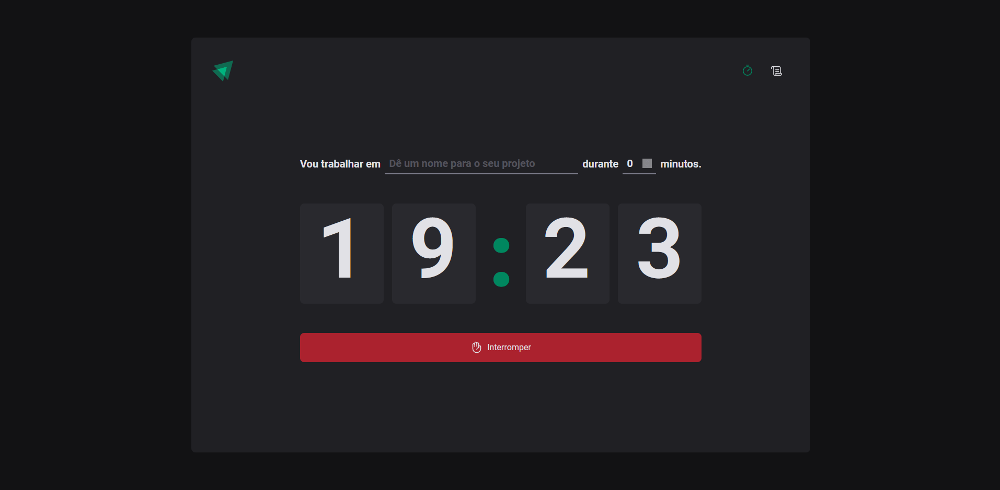

  

## ✨ Technologies

This project was developed with the following technologies:

- TypeScript
- React
- Reduce by React
- Context by React
- React-Router-Dom
- React Hook Form
- Styled Components
- EsLint
- zod
- Date Fns
- immerJs

## 💻 Project

A timer application that uses the Pomodoro Technique as a base. 

## 🚀 Deploy

- Clone the repository
- Install dependencies with `npm install`
- Start the server with `npm run dev`

You can now access [`localhost:3000`](http://localhost:3000) from your browser.

Project made in Ignite an acceleration program with React from @Rocketseat ♥ 
